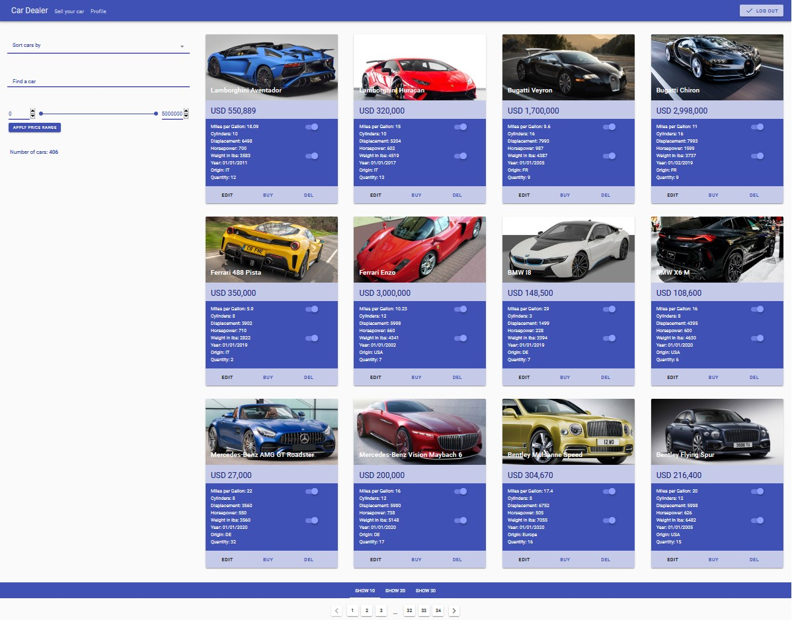
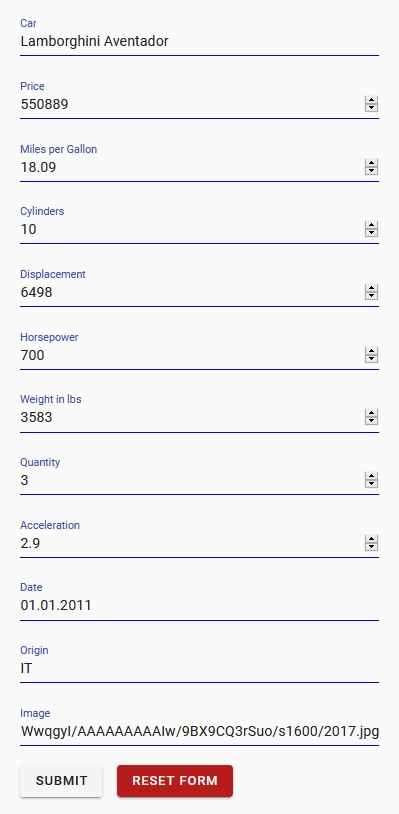
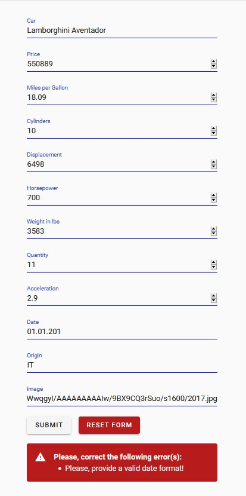
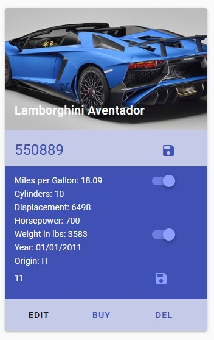
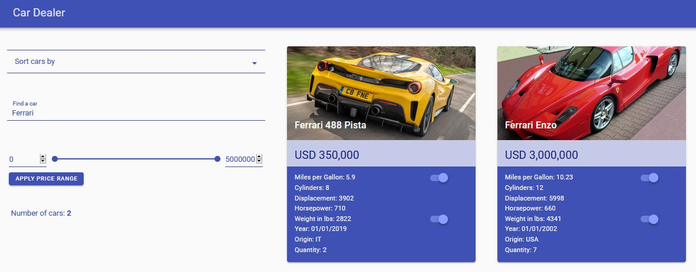
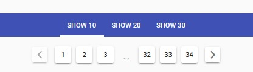
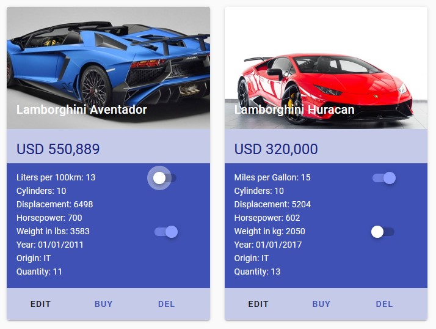
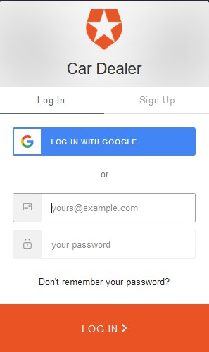
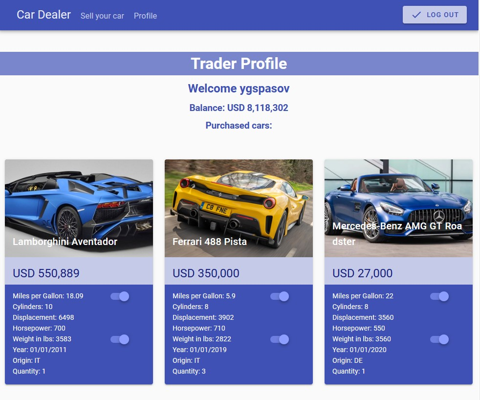
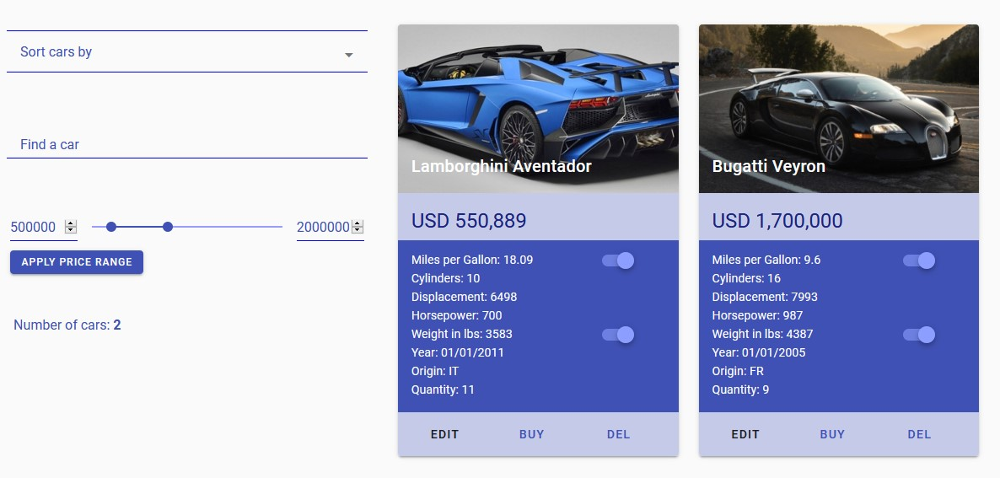

# car-dealer

A VueJS application for purchasing and selling cars. It uses [Axios](https://github.com/axios/axios) and [JSON Server](https://github.com/typicode/json-server) to simulate database requests. The front end is handled by [VueJS](https://vuejs.org/) and [Vuetify](https://vuetifyjs.com/en/). It is a complete CRUD app that allows you to purchase existing cars, place new cars for sale, edit car parameters or remove cars from sale. The search function gives you the option to look for a particular car or cars from a certain car manufacturer. The sorting functionality is extensive and explained below. All data is read from and saved in a JSON file, meaning the changes are permanent.

The app also uses [VueRouter](https://router.vuejs.org/) for handling routs and [Moment.js](https://momentjs.com/) for handling dates.

Functionality:

## Put a car on sale

You can put your car on sale using this form to submit all the car's details such as the name of the car, its price, its picture and all the other relevant related information listed on the screenshot.

## Validation

The car submit form comes with validation that works from the top to the bottom input field. It checks all the fields in that order to determine whether the user has entered valid car data and displays an error in red if any field's validation fails. If all checks pass, you're greeted with the message "Your car has been added to the Car Trader!" in green, after which you can see your vehicle listed for sale among all the other cars.

## Edit and delete a car

To remove a car from sale, simply hit "Del" and it will no longer be listed under cars for sale. Editing works in a similar way by pressing the "Edit" button but requires you to enter new data about a particular car. Currently, you can only edit the price and quantity. In order to save the data, you must click on the small diskette icons to the right side of each input field on the screenshot.

## Search by name

You can search for a particular car or car model. The search is case insensitive. The resulting set of data will also display the number of cars that match your search criteria in the sidebar.

## Sort by the following criteria

You can sort all cars by the following criteria:

- By name ascending
- By name descending
- By price ascending
- By price descending
- By horsepower ascending
- By horsepower descending
- By origin ascending
- By origin descending
- By cylinders ascending
- By cylinders descending
- By displacement ascending
- By displacement descending
- By weight ascending
- By weight descending
- By miles per gallon ascending
- By miles per gallon descending

## Pagination

The pagination divides the resulting set of cars into different sets/pages. The user also has the option to display 10, 20, or 30 cars per page.

## Switchers

The switchers for each car allow you to easily convert liters per 100km to miles per gallon and weight in lbs to weight in kilograms, presenting you with a convenient way to compare values.

## Login and Register

The app uses [Auth0](https://auth0.com/) for authentication. Currently, you can only see your profile, sell a car, remove a car from sale or make changes to a car if you're logged in.

## User Bought cars

The information on the number of purchased cars becomes accessible after the user logs in. Each car has a quantity in the shop. After purchasing a car, the number of cars you've acquired is deducted from the shop and displayed under "Purchased cars" in the trader profile as shown below.

## Price range

You can use a price range filter to only display the cars in the shop that match your budget.

